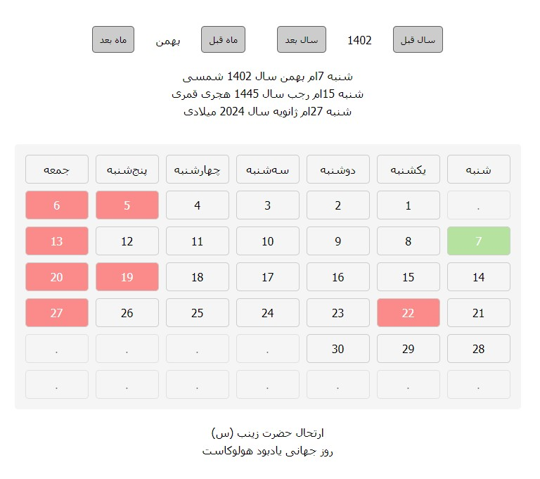

# **Persian Calendar**
Persian calendar with Iran's official holidays and Iranian calendar events and Islamic and world events. And also support for Hijri and Gregorian dates.

This Js library has the ability to display the Iranian calendar along with the official holidays of the Iranian calendar with the occasions of the Iranian calendar or the Islamic occasions of the Hijri lunar calendar.
Also, this calendar supports the Gregorian date.

 - [Demo](#Demo)
 - [Document](#Document)
 - [Usage](#Usage)
 - [Apis](#Apis)
 - [Events](#Events)

## **Support Information**

Support for Islamic occasions and holidays is up to the date of 1464 AH, which needs to be updated for the following years.


## **Demo**

Demo version screenshot. \
Online demo version url: [See Demo](https://codepen.io/mohamadhpp/pen/zYbKVzq)




## **Document**

IRPersianCalendar option for set when create object from class. \
These are the default values that will be like this during construction without needing any initialization.

```
option =
{
    html:
    {
        id: "IR_PersianCalendar",

        daysTitleId: 'irp_day_names',
        dayTitleClass: 'irp-day-name',

        daysId: "irp_days",
        dayClass: "irp-day",

        holidayClass: "holiday",
        fridayClass: "friday",
        disableClass: "disable",
        selectedClass: "selected",
        todayClass: "today",

        disableContent: "."
    },

    config:
    {
        from: undefined,
        to: undefined,

        updateToday: true,
        updateTodayTimeout: 5000,

        selectable: true,

        persianEvent: true,
        hijriEvent: true,
        officialWorldEvent: true,
        unofficialWorldEvent: true
    }
};
```
## **Usage**

It is recommended to review the test project.

Add script to html file.

```
<div id="IR_PersianCalendar"></div>

...

<script src="IRPersianCalendar.min.js"></script>
```
    
And create object from IRPersianCalendar class and use this:

```
let persian_calender = new IRPersianCalendar();
persian_calender.init();
```

After create and init calendar you need set style for calendar.
## **Apis**

You can use this apis in calendar.

```
setOption(option); //set new option
getOption(); //current option value
```

helper apis:

```
persianMonthName(month); //persian month name use month number
hijriMonthName(month); //for hijri
gregorianMonthName(month); //for gregorian

Example:

persian_calender.hijriMonthName(1); //output: محرم
```

Get today date or user selected date:

```
getToday(); //get today date
getSelectedDay(); //get selected date

Example:

persian_calender.getToday(); //output: [1402, 10, 21]
```

Change date (year and month) using this method:

```
setYear(year, month = undefined); //you can change calendar year and if needed, the month 
setMonth(month); //you can change month

Example: 

persian_calender.setYear(1405);
```

Change date with going a next or previous month or year:

```
prevMonth();
nextMonth();

prevYear();
nextYear();

Example:
persian_calender.nextMonth(); //output: [1402, 11, 21]

if the date is equal to: 1402/10/21
after calling this api the date changes to: 1402/11/21
```

Get today or user selected date info:

```
getTodayPersianInfo();
getSelectedDayPersianInfo();

getTodayGregorianInfo();
getSelectedDayGregorianInfo();

getTodayHijriInfo();
getSelectedDayHijriInfo();

Example:

persian_calender.getTodayPersianInfo(); //output: جمعه 22ام دی سال 1402 شمسی
persian_calender.getSelectedDayHijriInfo(); //output: سه‌شنبه 24ام شعبان سال 1445 هجری قمری
```

And you can see the event for today's date and user selected date:

```
getTodayEvents();
getSelectedDayEvents();

Example: 

persian_calender.getSelectedDayEvents();

//output:
hijri_events: []
official_world_events: []
persian_events: ['روز درختکاری']
unofficial_world_events: []
```


## **Events**
After selecting the date by the user, you can find out about the date selected by the user.

```
persian_calender.addEventListener("selectDate", function(selected_date)
{
	...
});

Sample 'selected_date':

selected_day = 
{
    "date": [1402, 11, 5],
    "hijri_date": [1445, 7, 13],
    "gregorian_date": [2024, 1, 25],

    "persian_events": [],
    "hijri_events": ["ولادت امام علی (ع)"],
    "official_world_events": [],
    "unofficial_world_events": []
}
```

Another event is update today date when page is on and going to new day.


```
persian_calender.addEventListener("updateTodayDate", function()
{
	...
});
```
